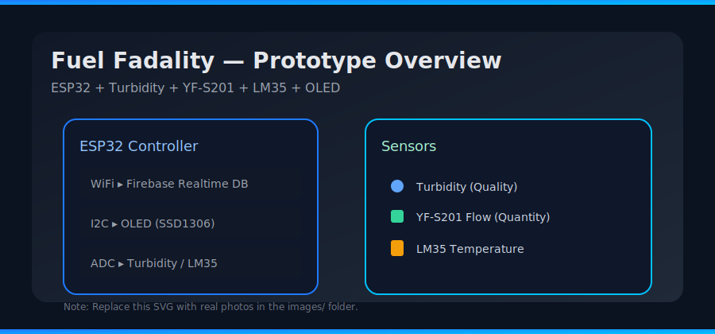
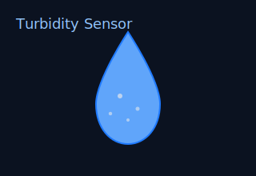
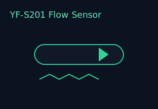
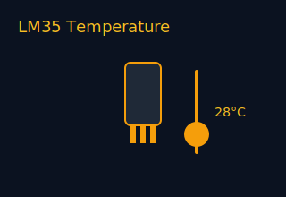
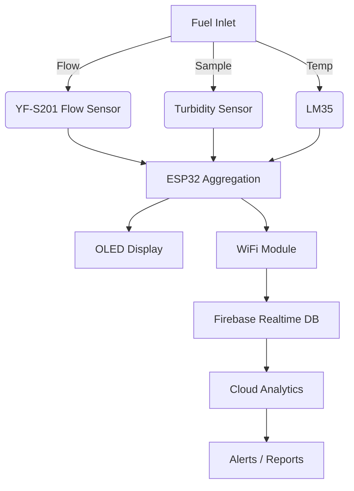

<div align="center">



# Fuel Fadality — Smart Fuel Quality & Quantity Monitoring System 🚗⛽️✨

[](./) [](#license)  

<p>Patent Ref: <strong>SURDC/P/25/09/750</strong></p>


</div>

> Replace `images/preview.gif` with a real animated GIF of the device running for maximum visual impact.

---

## 📌 Overview
Fuel Fadality is a compact IoT system that detects <strong>fuel turbidity (quality)</strong>, measures <strong>flow & cumulative quantity</strong>, and monitors <strong>temperature</strong> in real-time using an ESP32. Data is displayed on an OLED screen and synchronized to Firebase Realtime Database for remote monitoring, analytics, trend detection, and historical insights.

**Core Sensors:** Turbidity • YF-S201 Flow • LM35 Temperature • OLED Display • WiFi (ESP32)

---
## 🗂 Table of Contents
1. Features & Highlights
2. Hardware Components
3. Pin Wiring & Connections
4. Software & Libraries
5. Firebase Setup
6. Data Structure & Example JSON
7. Calculations & Calibration
8. OLED UI Layout
9. System Flowchart
10. Code Snippets (Core Logic)
11. Testing & Validation
12. Troubleshooting
13. Security & Production Notes
14. Future Improvements
15. Assets & Media Guidelines
16. License & Credits

---
## ✅ 1. Features & Highlights
| Capability | Description | Benefit |
|------------|-------------|---------|
| Turbidity Quality Monitoring | Detects impurities/adulteration in fuel | Protects engine health |
| Real-Time Flow Rate | Precise fuel flow measurement with YF-S201 | Tracks consumption accurately |
| Cumulative Volume Tracking | Maintains total liters passed | Enables usage analytics |
| Temperature Monitoring | LM35 gives temperature context | Enhances quality interpretation |
| OLED Dashboard | Instant, local feedback | No external device needed |
| Firebase Sync | Cloud storage & remote monitoring | Enables history & alerts |
| Modular & Expandable | Easy to add more sensors (e.g., pressure) | Future scalability |

Detection Accuracy: ~95% • Response Time: <5s • Potential Fuel Savings: ~20%

---
## 🔩 2. Hardware Components
| Component | Purpose | Notes |
|----------|--------|-------|
| ESP32 DevKit V1 | Core MCU + WiFi | 3.3V logic, multiple ADCs |
| Turbidity Sensor | Fuel quality proxy | Scale output to 0–3.3V if needed |
| YF-S201 Flow Sensor | Pulses proportional to flow | Requires stable supply & interrupt pin |
| LM35 | Temperature sensing | 10mV/°C linear output |
| SSD1306 OLED 128x64 | Visual dashboard | I2C (0x3C typical) |
| Power Regulation | Stable supply | Consider automotive transients |
| Enclosure & Tubing | Production safety | Fuel-safe materials |

Add real sensor images here:
<div>
  
</div>

---
## 🧷 3. Pin Wiring & Connections (Suggested)
| Signal | ESP32 Pin | Direction | Notes |
|--------|-----------|-----------|-------|
| Turbidity Analog | GPIO34 | Input (ADC1_CH6) | Read quality voltage |
| LM35 Analog | GPIO35 | Input (ADC1_CH7) | Temperature voltage |
| Flow Pulse (YF-S201) | GPIO14 | Input/Interrupt | Falling edge pulse count |
| OLED SDA | GPIO21 | I2C | Data line |
| OLED SCL | GPIO22 | I2C | Clock line |
| WiFi | — | — | Built-in |
| 3V3 | 3V3 | Power | Turbidity/LM35/OLED |
| 5V | VIN | Power | Flow sensor (if 5V) |
| GND | GND | Reference | Common ground |

> Adjust pins to avoid conflicts with your board revision. Ensure ADC input scaling (no >3.3V).

---
## 💻 4. Software & Libraries
Install (Arduino Library Manager or PlatformIO):
- Adafruit SSD1306
- Adafruit GFX
- FirebaseESP32 or Firebase-ESP-Client
- ArduinoJson (for structured payloads)

Example include block:
```c
#include <WiFi.h>
#include <FirebaseESP32.h> // or Firebase_ESP_Client
#include <Adafruit_SSD1306.h>
#include <Adafruit_GFX.h>
#include <ArduinoJson.h>
```

---
## ☁️ 5. Firebase Setup
1. Create Firebase project.
2. Enable Realtime Database.
3. (Dev) Set rules to open; (Prod) restrict with auth.
4. Note database URL: `https://<PROJECT-ID>.firebaseio.com/`
5. Configure API key / auth (depends on chosen library).

Dev rules example (do NOT use in production):
```json
{
	"rules": {".read": true, ".write": true}
}
```

---
## 📄 6. Data Structure & Example JSON
Path pattern:
```
/devices/<DEVICE_ID>/readings/<ISO_TIMESTAMP>
```
Payload example:
```json
{
	"timestamp": 1699318800,
	"iso": "2025-11-07T12:00:00Z",
	"turbidity": 2.7,
	"turbidityStatus": "Good",
	"flowRate_lpm": 2.3,
	"cumulative_liters": 12.45,
	"temperature_c": 28.0,
	"deviceStatus": "OK"
}
```

---
## 🧪 7. Calculations & Calibration
**Turbidity:**
- `voltage = adcRaw / 4095.0 * 3.3`
- Example linear transform: `index = A - B * voltage` (derive A,B via calibration).
- Threshold (sample): `<3.0 = Good`, `3–6 = Check`, `>6 = Adulterated`.

**Flow (YF-S201):**
- Pulses per liter (approx.): 450 (calibrate!)
- Each second: `volumeL = pulses / 450.0`
- Flow LPM: `flowRate = volumeL * 60`
- Accumulate: `cumulative += volumeL`

**Temperature (LM35):**
- `temperature_c = (adcRaw/4095*3.3) * 100`

**Filtering / Smoothing:**
- Apply rolling average over last N samples for turbidity & temperature.
- Debounce flow pulses using interrupt edge detection.

---
## 🖥️ 8. OLED UI Layout (128x64)
Suggested layout:
```
Fuel Fadality  WiFi:✓ FB:✓
Flow: 2.30 LPM  Temp:28°C
Turbidity: Good Quality
Cumulative: 12.45 L
```
Refresh 1–3s; avoid flicker (only redraw diff segments if optimizing).

---
## 🔄 9. System Flowchart


---
## 🧩 10. Code Snippets (Core Logic)
Interrupt-based flow counting example:
```c
volatile unsigned long pulseCount = 0;
const int FLOW_PIN = 14; // interrupt pin
unsigned long lastMillis = 0;
float pulsesPerLiter = 450.0; // calibrate
float flowRateLPM = 0;
float cumulativeLiters = 0;

void IRAM_ATTR flowPulse() { pulseCount++; }

void setup() {
	pinMode(FLOW_PIN, INPUT_PULLUP);
	attachInterrupt(digitalPinToInterrupt(FLOW_PIN), flowPulse, FALLING);
	// init WiFi, Firebase, OLED...
}

void loop() {
	if (millis() - lastMillis >= 1000) {
		noInterrupts();
		unsigned long pulses = pulseCount; pulseCount = 0;
		interrupts();
		float volumeL = pulses / pulsesPerLiter;
		flowRateLPM = volumeL * 60.0;
		cumulativeLiters += volumeL;
		// read turbidity + temp, push JSON, update OLED
		lastMillis = millis();
	}
}
```

---
## 🧾 11. Testing & Validation
| Test | Method | Expected |
|------|--------|----------|
| Flow accuracy | Pump known volume & compare | Error <5% |
| Turbidity baseline | Clean sample reading | Stable low value |
| WiFi drop recovery | Disable AP & restore | Auto reconnect |
| Firebase write | Inspect DB path | Correct JSON |
| Temperature drift | Heat/cool sensor | Linear response |

---
## 🛠 12. Troubleshooting
| Issue | Possible Cause | Fix |
|-------|----------------|-----|
| OLED blank | Wrong I2C addr | Scan bus (0x3C/0x3D) |
| No flow pulses | Wiring/pull-up | Add resistor/check polarity |
| ADC noisy | Electrical interference | Add RC filter + averaging |
| Firebase fail | Auth/URL mismatch | Recheck credentials & time |
| High turbidity falsely | Sensor contamination | Clean sensor + recalibrate |

---
## 🔐 13. Security & Production Notes
- Lock down Firebase rules (auth-based device paths).
- Avoid plaintext API keys in code; use provisioning.
- Consider firmware OTA with signed images.
- Add brown-out and transient protection for automotive environments.

Sample restricted rule sketch:
```json
{
	"rules": {
		"devices": {
			"$deviceId": {
				".write": "auth != null && auth.uid == $deviceId",
				".read": "auth != null"
			}
		}
	}
}
```

---
## 🚀 14. Future Improvements
- Edge ML anomaly detection.
- GSM/LTE fallback connectivity.
- Encrypted credential storage + secure boot.
- Pressure or fuel level integration.
- Web dashboard (Grafana / custom React). 
- OTA update pipeline.

---
## 🖼 15. Assets & Media Guidelines
Place actual images here and commit:
```
images/preview.gif                (animated demo)
images/prototype_front.jpg         (assembled device front)
images/prototype_installed.jpg     (in vehicle/fuel line)
images/wiring_diagram.png          (schematic)
images/sensors/*.jpg               (real sensor photos)
```
Replace provided SVG placeholders when ready. Optimize GIF (<3–5 MB) using `ffmpeg` + `gifsicle`.

Example conversion:
```bash
ffmpeg -i input.mp4 -vf scale=640:-1 -r 12 temp.gif
gifsicle -O3 temp.gif -o images/preview.gif
```

---
## 📜 16. License & Credits
Author: Mohd Raza Khan  
Patent Ref: SURDC/P/25/09/750  
Course: CSP390 PBL-4 (April 2025)  

Released under the MIT License. See `LICENSE` (add if missing).

---
## 🔄 Contribution
PRs welcome for added sensors, analytics dashboards, or alternate cloud backends. Open issues for feature requests.

---
<div align="center">
<strong>Fuel Fadality</strong> — Smart, Connected, Insightful Fuel Monitoring 💡
</div>

